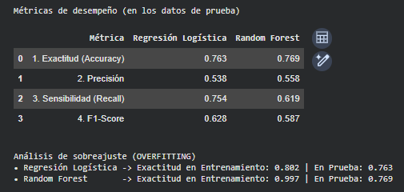

<h1 align="center">🤖 Challenge TelecomX Parte 2 - Predicción de Churn</h1>

<p align="center">
  
  
  
  
</p>

<p align="center">
  🔗 <a href="https://github.com/Aiello-M/Challenge-TelecomX_Parte2" target="_blank">Ver repositorio</a> 
  <a href="https://colab.research.google.com/github/Aiello-M/Challenge-TelecomX_Parte2/blob/main/Challenge_TelecomX_Parte2.ipynb" target="_blank">Abrir Notebook en Colab</a>
</p>

---

## 📚 Sobre el Challenge

**Challenge**: Este desafío forma parte del curso de especialización en Data Science de [Alura Latam](https://www.aluracursos.com/)

**Programa**: Oracle Next Education (ONE) - G9 en colaboración con Alura Latam

**Formación**: Estadisticas y Machine Learning G9 - ONE

---

## 📝 Descripción General

El proyecto **TelecomX (Parte 2)** tiene como objetivo desarrollar y evaluar modelos predictivos de *Machine Learning* capaces de anticipar la evasión de clientes (churn). Utilizando algoritmos de clasificación supervisada (**Regresión Logística** y **Random Forest**), se busca identificar patrones de comportamiento para detectar clientes con alto riesgo de cancelar el servicio y proponer estrategias de negocio sustentadas en datos empíricos.

---

---

## 🗂️ Estructura del Proyecto

```text
Challenge-TelecomX-Parte2/
│
├── Challenge-TelecomX_Parte2.ipynb  # Notebook principal con modelos de ML
├── README.md                        # Documentación del proyecto
├── assets/                          # Imágenes para documentación
│   ├── imgPerfil.jpg                # Foto de perfil
│   ├── parte2_img1.png              # Gráfico de Proporción de Churn
│   ├── parte2_img2.png              # Gráfico de Estandarización
│   ├── parte2_img3.png              # Matriz de Confusión
│   └── parte2_img4.png              # Importancia de Variables
│
└── datos/                           # Datasets
    ├── TelecomX_Data.json           # Dataset original de TelecomX Parte 1
    ├── datos_tratados.csv           # Dataset de entrada (Fase 1)
    ├── telecom_codificado.csv       # Dataset post One-Hot Encoding
    └── telecom_final_ml.csv         # Dataset final utilizado en modelos
```

## 🔍 Metodología y Fases del Análisis

El proyecto se estructura en 4 fases principales enfocadas en el preprocesamiento avanzado y modelado:

### **Fase 1: 🔧 Preparación de los Datos**
1. **1.1 Extracción**: carga de `datos_tratados.csv` (7,043 registros × 23 variables).
2. **1.2 Eliminación de Columnas Irrelevantes**: variables redundantes, con multicolinealidad o sin relación estadística tras prueba de Chi-Cuadrado (`customer_id`, `cuentas_diarias`, `total_charges`, `cantidad_servicios`, `gender`, `phone_service`).
3. **1.3 Encoding**: transformación de variables categóricas mediante **One-Hot Encoding**.
4. **1.4 Verificación de Desbalanceo**: análisis de la variable objetivo revelando un ratio de 2.77 a 1 (73.46% retenidos vs 26.54% cancelados).
5. **1.5 Balanceo de Clases**: aplicación de la técnica **SMOTE** (Synthetic Minority Over-sampling Technique) para equilibrar el dataset de entrenamiento.
6. **1.6 Estandarización**: aplicación de **Z-score** (`StandardScaler`) a variables numéricas continuas (`tenure` y `monthly_charges`).

### **Fase 2: ✂️ División del Dataset**
- Separación de datos mediante **train-test split estratificado** (70% entrenamiento / 30% prueba) garantizando la misma proporción de evasión en ambas muestras.

### **Fase 3: 🚀 Modelado Predictivo y Evaluación**
- Entrenamiento de los modelos **Regresión Logística** y **Random Forest**.
- **Análisis Crítico:** se seleccionó la **Regresión Logística** debido a su consistencia (sin síntomas de overfitting) y su superioridad en la métrica clave del negocio: **Sensibilidad (Recall) del 76.3%**.

### **Fase 4: 📊 Interpretación y Conclusiones**
- Análisis de coeficientes direccionales (Regresión Logística) e importancia relativa de variables (Random Forest) para aislar los factores de riesgo y retención.

### **Fase 5: 💾 Exportación de Datos**
- Exportación de `telecom_codificado.csv` y `telecom_final_ml.csv` para auditorías o re-entrenamientos futuros.

---

## 📷 Visualizaciones Destacadas

<table>
  <tr>
    <td align="center">
      <strong>⚖️ Desbalanceo de Clases (Fase 1.4)</strong><br>
      
    </td>
    <td align="center">
      <strong>📏 Estandarización Z-score (Fase 1.6)</strong><br>
      
    </td>
  </tr>
  <tr>
    <td align="center">
      <strong>🎯 Desempeño del Modelo (Fase 3.2)</strong><br>
      
    </td>
    <td align="center">
      <strong>📈 Importancia de Variables (Fase 4.1)</strong><br>
      
    </td>
  </tr>
</table>

---

## 💡 Hallazgos Principales

El análisis comparativo de ambos algoritmos aisló 3 ejes fundamentales que explican el Churn:

1. **Sensibilidad al precio:** los cargos mensuales (`monthly_charges`) son el factor de riesgo más importante; a mayor costo, mayor es la probabilidad de cancelar.
2. **Estabilidad del vínculo:** la antigüedad del cliente (`tenure`) y los contratos a largo plazo (1 o 2 años) actúan como barreras sólidas de retención frente a la volatilidad del contrato mensual.
3. **Integración con el ecosistema:** el servicio de **Fibra Óptica**, cuando es acompañado de servicios complementarios como **Soporte Técnico** o **Seguridad Online**, genera un fuerte grado de fidelización.

---

## 🎯 Recomendaciones de Negocio

**1. Fomentar contratos a largo plazo**<br>
Ofrecer incentivos (descuentos promocionales o congelamiento temporal de tarifas) a los clientes con contrato mensual para migrar hacia planes anuales o bianuales.

**2. Mejorar el valor percibido de los planes más costosos**<br>
En lugar de reducir precios, aumentar el valor de los planes premium (como Fibra Óptica) incluyendo servicios adicionales como Soporte Técnico sin costo extra.

**3. Implementar seguimiento a clientes nuevos**<br>
Dado que la baja antigüedad es un factor de alto riesgo, se recomienda diseñar programas de acompañamiento y asistencia técnica durante los primeros meses de servicio.

**4. Sistema de Alerta Temprana**<br>
Integrar el modelo de Regresión Logística en el sistema de atención para calificar clientes en tiempo real y priorizar intervenciones preventivas antes de que se solicite la baja.

---

## 🛠️ Tecnologías Utilizadas

- **Google Colab** – Entorno de desarrollo en la nube
- **Python 3.8+** – Lenguaje de programación
- **Pandas / NumPy** – Manipulación y operaciones matemáticas
- **Scikit-Learn** – Algoritmos de Machine Learning y métricas
- **Imbalanced-Learn (SMOTE)** – Balanceo de datos
- **Matplotlib / Seaborn** – Visualización de datos y coeficientes

---

## 🚀 Cómo Ejecutar el Proyecto

### Opción 1: Google Colab (Recomendado)
1. Abre el [notebook en Colab](https://colab.research.google.com/github/Aiello-M/Challenge-TelecomX_Parte2/blob/main/Challenge_TelecomX_Parte2.ipynb) 
2. Click en **"Copiar en Drive"**.
3. Sube el archivo `datos_tratados.csv` a la sesión de Colab.
4. Ejecuta todas las celdas: `Entorno de ejecución` → `Ejecutar todo`.

### Opción 2: Jupyter Notebook Local
```bash
# Clonar repositorio
git clone [https://github.com/Aiello-M/Challenge-TelecomX_Parte2.git](https://github.com/Aiello-M/Challenge-TelecomX-Parte2.git)

# Navegar al directorio
cd Challenge-TelecomX_Parte2

# Instalar dependencias
pip install pandas numpy scikit-learn imbalanced-learn matplotlib seaborn

# Abrir notebook
jupyter notebook Challenge_TelecomX_Parte2.ipynb
```

## ✒️ Autora

| [<br><sub>Mariana Aiello</sub>](https://github.com/Aiello-M) |
| :---: |

---

## 📝 Licencia

Este proyecto es de código abierto y está disponible bajo la licencia MIT.

---

<p align="center">
  Desarrollado con 💙 como parte del programa Oracle Next Education (ONE) - G9
</p>
