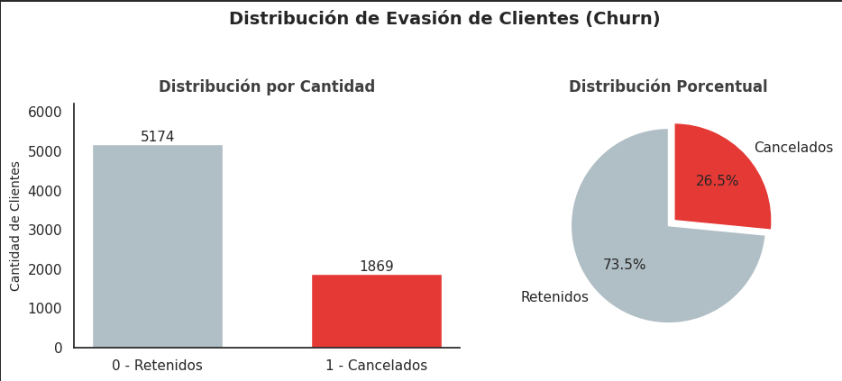
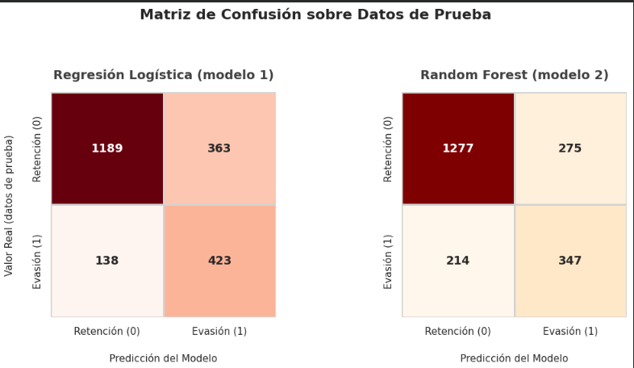
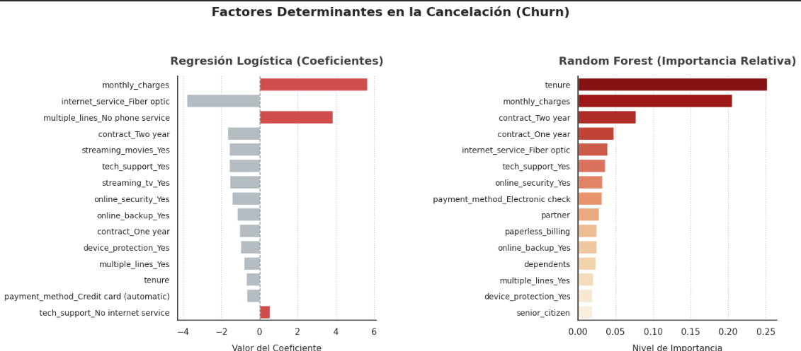

# Challenge-TelecomX_Parte2
Análisis de Evasión de Clientes (Churn) Parte 2 - Proyecto Data Science Alura Latam - Oracle Next Education (ONE) - G9 

---

## 📊 Parte 2: Modelado Predictivo y Machine Learning

### Objetivo
Desarrollar y evaluar modelos de *Machine Learning* para predecir la evasión de clientes (churn) y proponer estrategias de retención basadas en evidencia.

### Notebook
- **Archivo:** `Challenge_TelecomX_Parte2.ipynb`
- **Enlace:** [Ver Notebook Parte 2](./Challenge_TelecomX_Parte2.ipynb)

### Contenido

#### 1️⃣ Preparación de Datos
- Eliminación de variables irrelevantes (customer_id, total_charges, phone_service)
- Encoding de variables categóricas (One-Hot Encoding)
- Estandarización de variables numéricas (StandardScaler)
- Balanceo de clases con SMOTE

#### 2️⃣ Análisis de Correlación
- Matriz de correlación de Pearson
- Análisis dirigido: distribución de variables clave vs churn
- Identificación de factores predictivos

<p align="center">
  
</p>

#### 3️⃣ Modelado Predictivo
- **Modelos implementados:**
  - Regresión Logística (con estandarización)
  - Random Forest (sin estandarización)
- **División de datos:** 70% entrenamiento / 30% prueba
- **Técnica de balanceo:** SMOTE aplicado solo en train

##### Resultados Comparativos

| Métrica | Regresión Logística | Random Forest |
|---------|---------------------|---------------|
| **Accuracy** | 76.3% | 76.9% |
| **Recall** ⭐ | **75.4%** | 61.9% |
| **Precision** | 53.8% | 55.8% |
| **F1-Score** | **0.628** | 0.587 |

<p align="center">
  
</p>

**Modelo seleccionado:** **Regresión Logística**  
**Justificación:** Mayor sensibilidad (Recall 75.4%) para detectar clientes en riesgo. En retención, el costo de un Falso Negativo (cliente perdido) supera al costo de un Falso Positivo (promoción preventiva).

#### 4️⃣ Análisis de Importancia de Variables

**Factores más influyentes en la evasión:**
1. **Antigüedad (tenure)** → Primeros 6-12 meses = mayor riesgo
2. **Tipo de contrato** → Mensual vs Anual
3. **Método de pago** → Manual vs Automático
4. **Servicio de internet** → Fibra óptica
5. **Cargo mensual** → Planes premium
6. **Cantidad de servicios** → A más servicios, menor churn

<p align="center">
  
</p>

#### 5️⃣ Estrategias de Retención Propuestas

🔴 **PRIORIDAD ALTA:**
- Programa de onboarding intensivo (primeros 6 meses)
- Incentivos para migración a contratos de largo plazo

🟡 **PRIORIDAD MEDIA:**
- Automatización de métodos de pago
- Revisión de propuesta de valor en planes premium

🟢 **IMPLEMENTACIÓN:**
- Integración del modelo en CRM
- Dashboard de monitoreo en tiempo real
- Acciones automatizadas por nivel de riesgo

### Hallazgos Clave
- ✅ El modelo de **Regresión Logística** logra detectar el **75.4%** de los clientes que cancelan
- ✅ Los **primeros 6 meses** son el período crítico de retención
- ✅ Contratos mensuales tienen **42.7%** de churn vs **11.3%** en contratos anuales
- ✅ La implementación de las estrategias puede reducir el churn en **20-35%**

### Tecnologías Utilizadas - Parte 2
- **Machine Learning:** scikit-learn (LogisticRegression, RandomForestClassifier)
- **Balanceo:** imbalanced-learn (SMOTE)
- **Métricas:** confusion_matrix, classification_report, ROC-AUC
- **Visualización:** matplotlib, seaborn

---
```

**3. Guardar cambios:**
- Scroll hasta abajo
- Mensaje de commit: `docs: Actualizar README con Parte 2`
- Click **"Commit changes"**

---

## **✅ CHECKLIST FINAL:**
```
□ Notebook renombrado: Challenge_TelecomX_Parte2.ipynb
□ 6 imágenes capturadas y nombradas (parte2_img1-6.png)
□ Notebook subido a la raíz del repositorio
□ Imágenes subidas a assets/
□ README.md actualizado con sección Parte 2
□ datos_tratados.csv subido (opcional)
```

---

## **🎯 NOMBRE DEL COMMIT FINAL:**

Cuando subas todo, usá este mensaje:
```
feat: Completar Parte 2 - Modelado Predictivo ML

- Agrega notebook con análisis completo de ML
- Implementa Regresión Logística y Random Forest
- Incluye análisis de importancia de variables
- Propone 5 estrategias de retención
- Actualiza README con resultados y hallazgos
